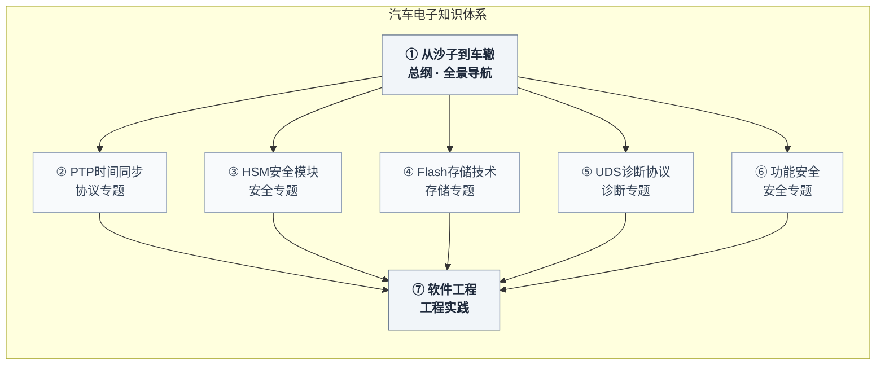

# Lularible

感谢所有在有限资源下依然选择前进的人。

---

## 开源技术书系

正在创作中的系列：

### 汽车电子七部曲

从芯片到系统、从协议到安全、从工程到哲学，一套覆盖汽车电子完整知识链的开源技术书系。

|  | 书名 | 专题 | 配套代码 | Stars |
|---|------|------|---------|-------|
| ① | **从沙子到车辙（总纲）** | 计算哲学、芯片物理、处理器、通信、AUTOSAR、系统、工程哲学 | — |  |
| ② | **PTP 时间同步** | IEEE 1588/gPTP、LinuxPTP 源码、ptp-lite 实现 | 🖥️ ptp-lite（~1000 行 C） |   |
| ③ | **HSM 安全模块** | PKCS#11 v3.1、SoftHSM2 源码、hsm-lite 实现 | 🖥️ hsm-lite（~620 行 C） |  |
| ④ | **Flash 存储技术** | Flash 物理、LittleFS 源码、KnotFS 实现 | 🖥️ KnotFS（~840 行 C） |   |
| ⑤ | **UDS 诊断协议** | ISO 14229、AUTOSAR DCM 源码、uds-lite 实现 | 🖥️ uds-lite（~800 行 C） |  |
| ⑥ | **功能安全** | ISO 26262、安全机制设计、safe-lite 实现 | 🖥️ safe-lite（打磨中） | 🔄 打磨中 |
| ⑦ | **软件工程** | MISRA C、ASPICE、工程实践、eng-lite 实现 | 🖥️ eng-lite（打磨中） | 🔄 打磨中 |

---

### 系列特色

**从思想实验出发。** PTP 的第一章用一个问题开场：假设你周围的一切都静止了，你怎么知道时间还在走？HSM 从岩画与密码说起，存储从结绳记事讲起，UDS 从望闻问切开始。每本书的第一章都不是协议条文，而是一个让你建立直觉的思想实验，然后才进入硬核技术。

**原理、源码、动手实现。** 每本书不只讲原理，还会深入分析工业级开源实现的源码——LinuxPTP 的 9 种端口状态、SoftHSM2 的会话管理、LittleFS 的元数据对设计、AUTOSAR DCM 的诊断状态机。最后带你亲手实现一个轻量级的教学版本，代码可以真实运行。

**系统化知识图谱。** 7 本书覆盖从芯片物理到 AUTOSAR、从时间同步到功能安全的完整汽车电子知识链。每本书可以单独阅读，但合在一起能建立完整的认知框架。

---

### 快速入口

| 仓库 | 推荐阅读顺序 |
|------|-------------|
| [从沙子到车辙（总纲）](https://github.com/Lularible/from-sand-to-ruts) | **① 先读这本**，建立全景认知 |
| [PTP 时间同步](https://github.com/Lularible/ptp-book) | ② 协议方向 |
| [HSM 安全模块](https://github.com/Lularible/hsm-book) | ③ 安全方向 |
| [Flash 存储技术](https://github.com/Lularible/storage-book) | ④ 底层方向 |
| [UDS 诊断协议](https://github.com/Lularible/uds-book) | ⑤ 协议方向 |
| 功能安全（即将发布） | ⑥ 安全方向 |
| 软件工程（即将发布） | ⑦ 建议最后阅读 |

---

## 许可证

书籍内容：[CC BY-NC-ND 4.0](LICENSE) · 教学代码：MIT（详见各仓库）

---

<strong>Lularible</strong> 持续创作中

<strong>怕什么真理无穷，进一寸有一寸的欢喜。</strong> —— 胡适

